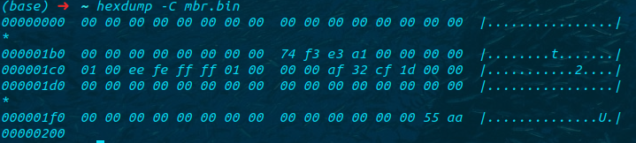
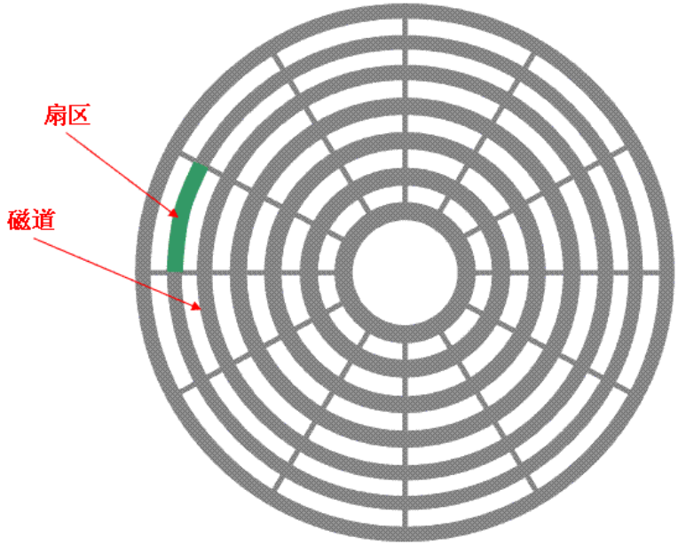
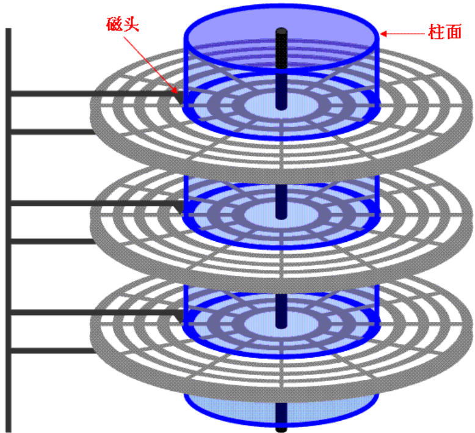
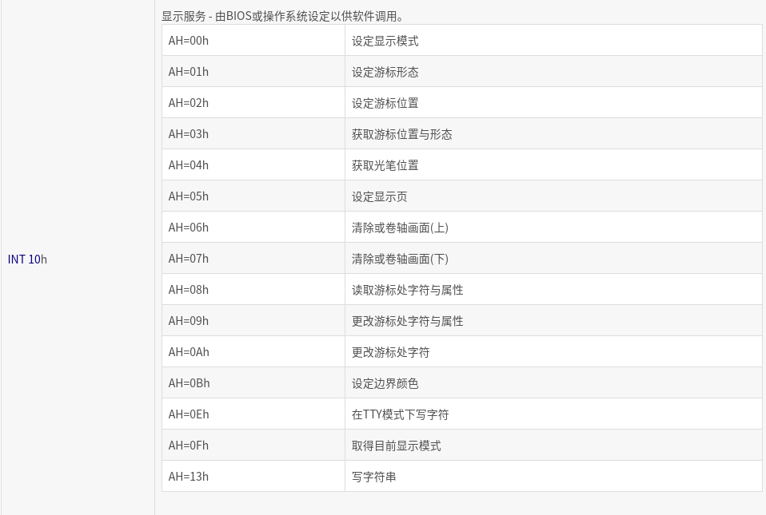
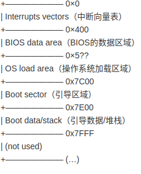

#  自制操作系统

- ## `环境搭建`

汇编语言编译程序：`nasm`

虚拟化模拟器：`qemu`

`ubuntu`环境配置

```bash
sudo apt-get install qemu-system-x86
sudo apt-get install nasm
```

----

- ### `主引导扇区`

  主引导扇区位于硬盘的0磁头0柱面1扇区，包括主引导记录`MBR`（Master Boot Record  这个记录占用***512字节***)和分区表`DPT`（Disk Partition table）

#### `MBR`结构

1. 主引导程序代码，占446字节

2. 磁盘签名

3. 硬盘分区表`DPT`，占64字节

4. 主引导扇区结束标志`55AAH`

   #### 查看`MBR`记录

```bash
sudo dd if=/dev/sda of=mbr.bin bs=1 count=512
hexdump -C mbr.bin
```



#### `DPT`

大小为64字节，分为4项，每一项占16字节，每一项意义如下

| 偏移  | 长度（字节） | 意义                                       |
| ----- | ------------ | ------------------------------------------ |
| `00H` | 1            | 00：非活动分区；80：活动分区；其他：无意义 |
| `01H` | 1            | 分区起始磁头号（HEAD）                     |
| `02H` | 2            | 分区起始扇区（SECTOR）；分区起始磁柱号     |
| `04H` | 1            | 文件系统标志位                             |
| `05H` | 1            | 分区结束磁头号（HEAD）                     |
| `06H` | 2            | 分区结束区号（SECTOR）；分区结束磁柱号     |
| `08H` | 4            | 分区起始相对扇区号                         |
| `0CH` | `4`          | 分区总的扇区数                             |

- #### `磁盘结构`







1. 磁头（head）

2. 磁道（track）

3. 柱面（cylinder）

4. 扇区（sector）

5. 圆盘（platter）

   扇区大小为512字节

   以上图为例：

此磁盘容量为6 × 7 × 12 × 521字节
$$
存储容量 = 磁头数×磁道数（柱面）×每道扇区数×扇区字节
$$
简单例子，当前只满足`MBR`结束标志，其他以0填充

#### 汇编

```assembly
loop:
	jmp loop
times 510 - ($ - $$) db 0
dw 0xaa55
```

#### 16进制

```ASN.1
e9 fd ff 00 00 00 00 00 00 00 00 00 00 00 00 00
00 00 00 00 00 00 00 00 00 00 00 00 00 00 00 00
00 00 00 00 00 00 00 00 00 00 00 00 00 00 55 aa
```

----

- ### `中断`

[BIOS](https://baike.baidu.com/item/BIOS/91424)中断调用（BIOS interrupt calls）是一组功能，为[DOS](https://baike.baidu.com/item/DOS/32025)程序与一些软件提供使用[IBM](https://baike.baidu.com/item/IBM/9190) PC兼容机上BIOS的功能。一些操作系统在系统引导时也使用BIOS以检测并初始化硬件资源。

调用这些中断，可以用`x86`汇编语言INT指令

指令原型：

```assembly
int n
```

1. n表示中断号，1字节正整数范围：【0~255】
2. 执行`int n`时，CPU从中断向量表中，找到第n号表项，修改`CS`和`IP`
3. 对`8086PC`
4. 中断向量表指定放在内存地址0处（地址固定），共1024个字节。每个表项占两个字，低字存放偏移地址，高字存放段地址

---

$$
IP = n * 4\\
CS = (n * 4 + 2)
$$

---

以在屏幕上打印HELLO为例

```assembly
mov ah,0x0e
mov al,'H'
int 0x10
mov al,'E'
int 0x10
mov al,'L'
int 0x10
int 0x10
mov al,'O'
int 0x10
jmp $
times 510-($ - $$) db 0
dw 0xaa55
```

| 中断      | 描述                                                         |
| --------- | ------------------------------------------------------------ |
| `INT 00h` | CPU: 除零错,或商不合法时触发                                 |
| `INT 01h` | CPU: 单步陷阱,TF标记为打开状态时,每条指令执行后触发          |
| `INT 02h` | CPU: [非可屏蔽中断](http://zh.wikipedia.org/w/index.php?title=Non-maskable_interrupt&action=edit&redlink=1), 如 [开机自我测试](http://zh.wikipedia.org/wiki/開機自我測試) 时发生内存错误触发 |
| `INT 03h` | CPU: 第一个未定义的中断向量, 约定俗成仅用于调试程序          |
| `INT 04h` | CPU: 算数溢出。通常由INTO指令在置溢出位时触发                |
| `INT 05h` | 在按下Shift-[Print Screen](http://zh.wikipedia.org/wiki/Print_Screen)或BOUND指令检测到范围异常时触发 |
| `INT 06h` | CPU: 非法指令                                                |
| `INT 07h` | CPU: 没有[数学协处理器](http://zh.wikipedia.org/wiki/8087协处理器)时尝试执行浮点指令触发 |
| ...       | ...                                                          |



# ...

- ### `0X7C00`

`X7C00` = `31kb`

当打开电脑电源，`BIOS`固定磁盘开始自检，然后触发19号中断，在处理19号中断时，BIOS检测电脑是否具有软盘/硬盘，如果有如何可用磁盘，`BIOS`就把磁盘的第一个扇区（`512B`）加载到内存的`0X7C00`地址处。再谈一下`0X0000~0X7C00`间的地址问题，如图：



```assembly
;定义
the_secret:
    db "X"
;尝试访问the_secret
mov ah, 0x0e
; 打印失败，打印地址而不是实际内容
mov al, "1"
int 0x10
mov al, the_secret
int 0x10

; 打印地址方法正确，不过BIOS把程序地址映射到0x7c00处
mov al, "2"
int 0x10
mov al, [the_secret]
int 0x10

mov al, "3"
int 0x10
mov bx, the_secret
add bx, 0x7c00
mov al, [bx]
int 0x10

;更好的方法
mov al, "4"
int 0x10
mov al, [0x7c2d]
int 0x10

jmp $
times 510-($-$$) db 0
dw 0xaa55
```

---

- ### `堆栈`

#### 相应的内容参考王爽的汇编教程

----

- ### `基础方法实现`

### 字符

```assembly
mystring:
	db 'Hello,world',0
```

###### 0定义结束

-------

#### 控制结构

```assembly
cmp ax,4
je ax_is_four
jmp else
jmp endif

ax_is_four:
	...
	jmp endif
else:
	...
	jmp endidf
endif:
```

---------

#### 方法调用

```assembly
mov al,'X'
jmp print
endprint:

....

print:
	mov ah,0x0e
	int 0x10
	jmp endprint
```

----

#### 文件导入

```assembly
%include "file.asm"
```

----

- ### `寄存器`

  #### 相应的内容参考王爽的汇编教程

  ---

  

- ### `硬盘交互`

#### 目前OS只在512字节内，这显然不行，需要从硬盘读取数据用来运行后面的内核